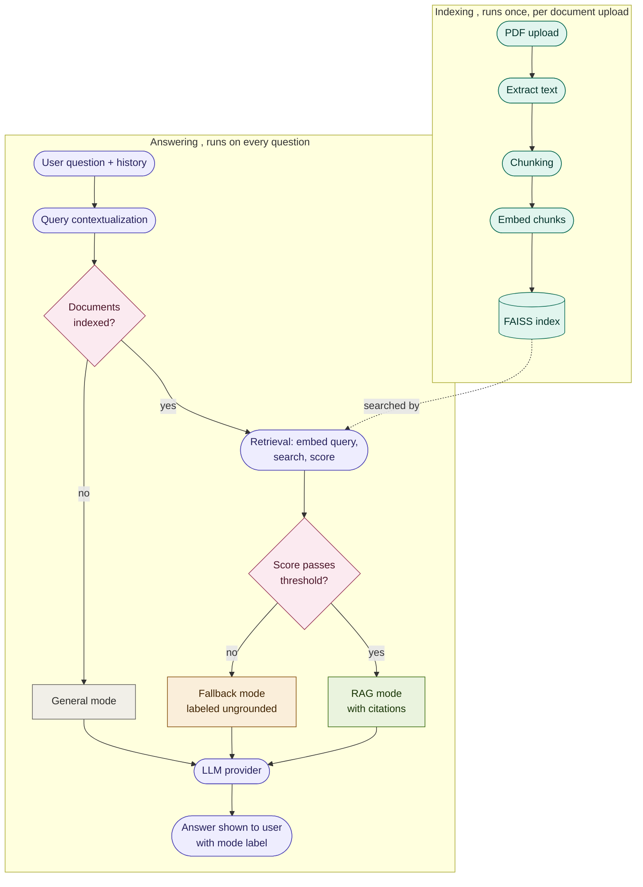

# 💠 Raggy

[](https://github.com/OT75/Raggy/actions/workflows/tests.yml)

A document-grounded assistant that answers questions from uploaded PDFs ,
with source citations, and honest disclosure when an answer isn't backed by
your documents.

## Overview

Most simple RAG tools blend "answered from your documents" and "answered
from general knowledge" into a single response, with no way to tell which is
which. Raggy solves this by routing every question through one of three
explicit modes:

| Mode               | When it triggers                              | Behavior                                                |
| ------------------ | --------------------------------------------- | ------------------------------------------------------- |
| **General**        | No documents uploaded                         | Plain conversational answer                             |
| **Fallback**       | Documents exist, but don't cover the question | General-knowledge answer, clearly labeled as ungrounded |
| **Grounded (RAG)** | Documents exist and cover the question        | Answer built from retrieved chunks, with sources shown  |

Routing is decided by a similarity score against the document index, not by
asking the model to self-report relevance , an inspectable, tunable signal
rather than a black box.

## Features

- **Three-mode response routing** with visible labeling of grounded vs.
  ungrounded answers
- **Multi-document knowledge base** , upload, view, and remove individual
  documents; the index updates incrementally rather than rebuilding from
  scratch on every change
- **Conversation memory** , follow-up questions are understood in context,
  not treated as isolated queries. Recent turns are kept in full; older
  turns that age out of the window are compressed into a running summary
  rather than discarded outright
- **Source citations** , every grounded answer links back to the exact text
  it was built from
- **Multi-provider generation** , Groq (Llama 3.3 70B) or OpenAI (GPT-4o mini)
  for answering, selectable per session, with an optional user-supplied API
  key. Embeddings always run locally (see Design notes) regardless of which
  provider is selected for generation.

## Architecture



Document embedding happens once, at upload time, and never touches the
question-answering path. The only embedding that happens per question is
embedding the query text itself, inside the retrieval step , a distinct,
much smaller operation from indexing a whole document. Both apps below
(Streamlit and FastAPI + React) run this exact logic; neither runtime shares
state with the other.

```
Raggy/
├── .github/workflows/
│   └── tests.yml       CI , runs the labeled eval on every push
├── backend/             FastAPI API , session-based, wraps rag_engine
│   ├── main.py
│   ├── rag_engine.py    Core RAG logic, framework-agnostic
│   ├── Dockerfile
│   ├── requirements.txt
│   └── tests/
│       ├── test_routing.py    Labeled routing + grounding eval
│       └── fixtures/
├── frontend/             React + TypeScript client (Vite)
│   ├── src/App.tsx
│   └── Dockerfile        Multi-stage build, served via nginx
├── docker-compose.yml    Runs backend + frontend together
└── streamlit_app/         Original prototype, kept as a lightweight fallback
    └── app.py
```

### Backend

FastAPI, with endpoints to add, list, and remove documents, and to ask
questions within a session. The vector index updates incrementally as
documents are added or removed, rather than being rebuilt from every
document on every change.

### Frontend

A React + TypeScript client built from scratch (no component library),
communicating with the backend over standard HTTP. Includes a document
manager for adding/removing individual files and visual indicators showing
which response mode produced each answer.

### Streamlit app

The original working prototype, preserved and functional. Serves as a fast,
dependency-light fallback and a reference point for how the project's
architecture evolved.

## Running it

**With Docker (recommended , runs both services together):**

```bash
docker compose up --build
```

Frontend at `http://localhost:5173`, backend at `http://localhost:8000`.

**Backend, without Docker:**

```bash
cd backend
pip install -r requirements.txt
uvicorn main:app --reload
```

**Frontend, without Docker:**

```bash
cd frontend
npm install
npm run dev
```

**Streamlit (standalone alternative):**

```bash
cd streamlit_app
pip install -r requirements.txt
streamlit run app.py
```

Each part reads API keys from a `.env` file (`GROQ_API_KEY` and/or
`OPENAI_API_KEY`). A key can also be supplied directly in the UI, which
takes priority over the `.env` default. `.env` is never baked into a Docker
image , it's excluded via `.dockerignore` and injected at container run time.

## Testing

A labeled routing eval (`backend/tests/test_routing.py`) checks two things
against real sample documents: does the router pick the correct mode
(general / fallback / grounded), and , for grounded answers , did retrieval
actually surface the chunk containing the answer, not just any chunk.

Generalized across two independently-written documents (an HR internship
handbook and an unrelated SaaS pricing/support policy) via one plain dict
mapping filename to labeled questions , testing a new document is a data
change, not a code change.

```bash
cd backend
pytest tests/test_routing.py -v -s
```

Current result: **35 tests, 32 passing, 3 known `xfail`s** , none hidden,
each with a documented reason in the test file. All three come from the
same root cause: a single global similarity threshold cannot perfectly
separate every case. One genuinely out-of-scope question can score _lower_
than several genuinely answerable ones, on both documents independently ,
evidence this is a real property of the approach (small local embeddings,
one global threshold), not a quirk of one document's phrasing. The
threshold (`score_threshold=1.5` in `rag_engine.py`) was empirically tuned
against the first document's eval and chosen to favor the safer failure
mode: an answerable question occasionally falling back, rather than an
irrelevant question being presented as grounded. Before tuning, the same
eval scored 12/20 (60%) at a guessed threshold of 1.0 on the first
document alone.

CI (`.github/workflows/tests.yml`) runs this eval on every push. It needs a
`GROQ_API_KEY` repository secret to actually execute , without one, it skips
cleanly rather than failing on a missing secret.

## Screenshots

| Chat interface                        | Document manager                                     |
| ------------------------------------- | ---------------------------------------------------- |
|  |  |

**The three response modes:**

| General                                    | Fallback (ungrounded)                        | Grounded (RAG)                     |
| ------------------------------------------ | -------------------------------------------- | ---------------------------------- |
|  |  |  |

## Design notes

- **Score-based routing over LLM self-assessment.** Deciding "is this
  grounded?" via a similarity-score threshold, rather than asking the model
  to judge its own relevance, keeps the decision inspectable and tunable ,
  and testable, per the Testing section above.
- **Threshold tuned empirically, not guessed.** The eval suite found real
  overlap between answerable and out-of-scope questions at the score level;
  no single threshold separates every case perfectly. See Testing above for
  the specific numbers and the reasoning behind which failure mode the
  current threshold favors.
- **Embeddings are always local, regardless of which LLM provider is
  selected.** Early on, embeddings followed whichever provider (Groq or
  OpenAI) was active at the moment a document was added. That meant two
  documents added under different provider selections could end up embedded
  in incompatible vector spaces inside the same FAISS index , a latent
  correctness bug, not just a cost/privacy tradeoff. Pinning embeddings to a
  single local model (HuggingFace `all-MiniLM-L6-v2`) fixes that, keeps
  document content off any third-party API, and costs nothing. The LLM
  provider selection still only affects generation.
- **Hand-rolled retrieval pipeline**, rather than a prebuilt LangChain
  chain. This traded some off-the-shelf robustness for full visibility into
  the retrieval-to-generation boundary, which was necessary while debugging
  how grounded and ungrounded answers were being surfaced.
- **In-memory sessions**, appropriate for a single-user local demo; a
  production deployment would need persistent, multi-user session storage.
- **Sliding-window chat history**, capped at the last 6 messages (3
  exchanges); older turns are dropped, not summarized. A summary-buffer
  layer (compressing overflow turns instead of discarding them) was
  designed and briefly working, and could be added baed on the avaialble resources.

## Stack

Python, FastAPI, LangChain, FAISS, HuggingFace embeddings, pypdf, Groq,
OpenAI, React, TypeScript, Vite, Streamlit, Docker, pytest, GitHub Actions.

## License

MIT , see [LICENSE](LICENSE).
