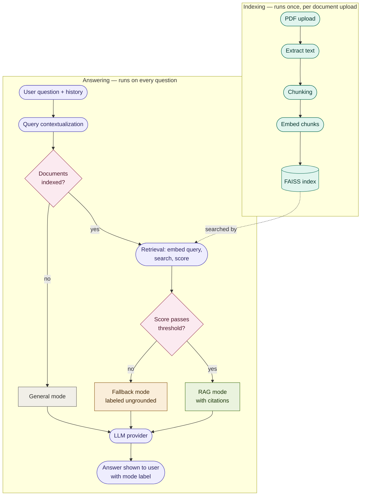
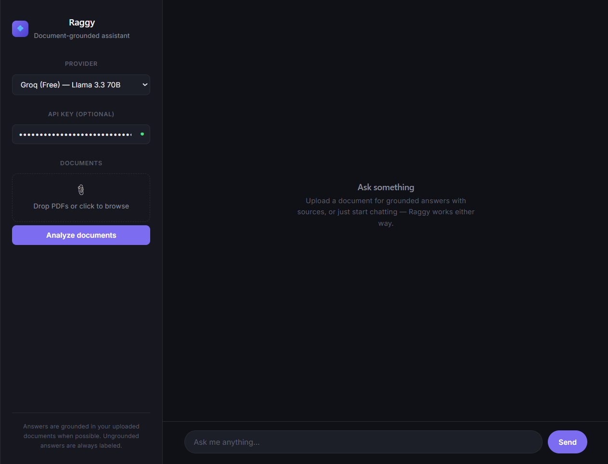
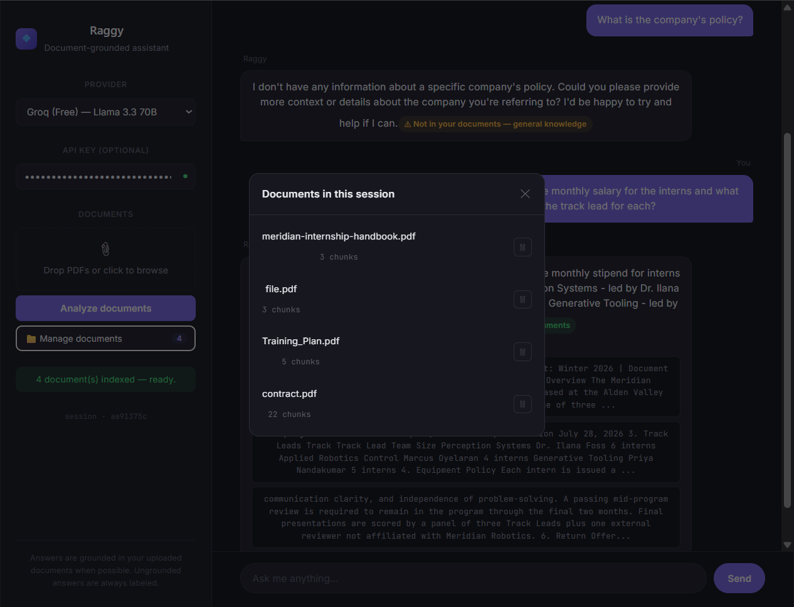
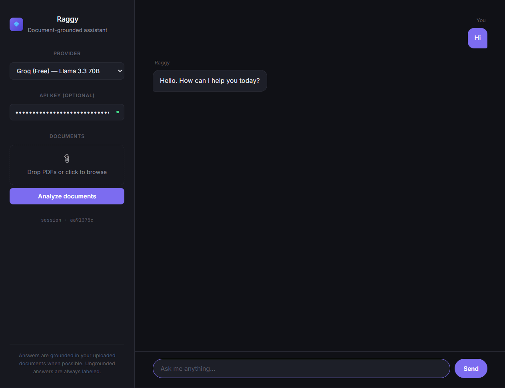
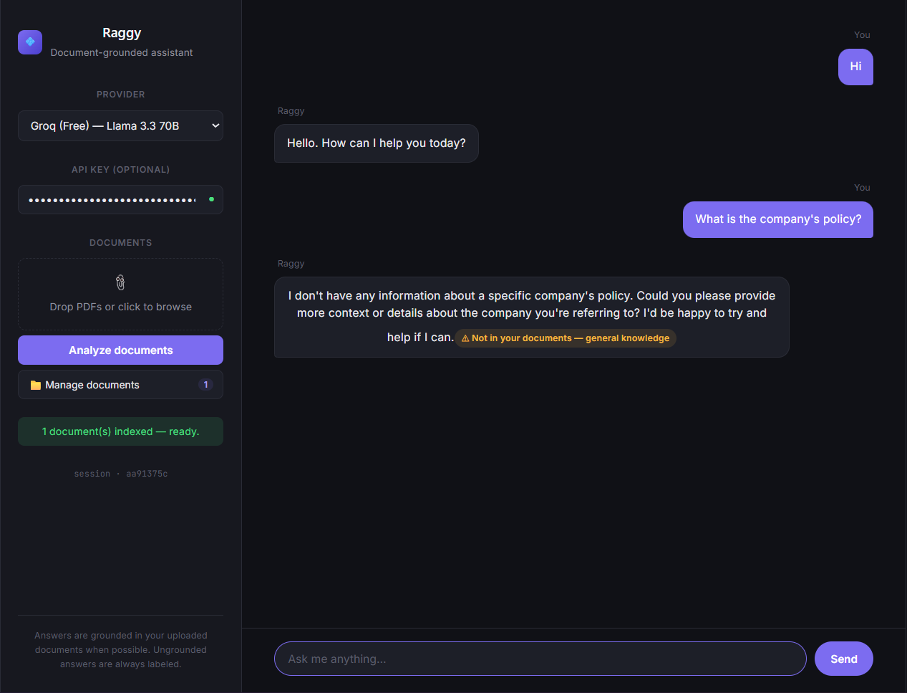
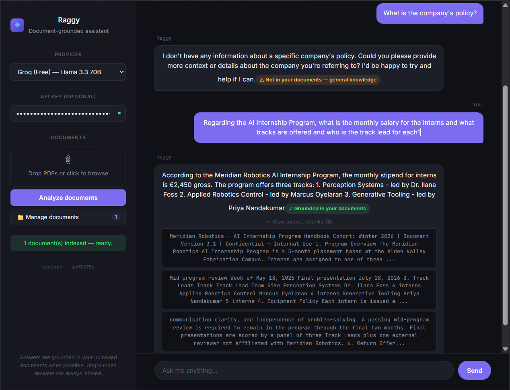

# 💠 Raggy

A document-grounded assistant that answers questions from uploaded PDFs —
with source citations, and honest disclosure when an answer isn't backed by
your documents.

## Overview

Most simple RAG tools blend "answered from your documents" and "answered
from general knowledge" into a single response, with no way to tell which is
which. Raggy solves this by routing every question through one of three
explicit modes:

| Mode | When it triggers | Behavior |
|---|---|---|
| **General** | No documents uploaded | Plain conversational answer |
| **Fallback** | Documents exist, but don't cover the question | General-knowledge answer, clearly labeled as ungrounded |
| **Grounded (RAG)** | Documents exist and cover the question | Answer built from retrieved chunks, with sources shown |

Routing is decided by a similarity score against the document index, not by
asking the model to self-report relevance — an inspectable, tunable signal
rather than a black box.

## Features

- **Three-mode response routing** with visible labeling of grounded vs.
  ungrounded answers
- **Multi-document knowledge base** — upload, view, and remove individual
  documents; the index updates incrementally rather than rebuilding from
  scratch on every change
- **Conversation memory** — follow-up questions are understood in context,
  not treated as isolated queries
- **Source citations** — every grounded answer links back to the exact text
  it was built from
- **Multi-provider support** — Groq (Llama 3.3 70B) or OpenAI (GPT-4o mini),
  selectable per session, with an optional user-supplied API key

## Architecture



Document embedding happens once, at upload time, and never touches the
question-answering path. The only embedding that happens per question is
embedding the query text itself, inside the retrieval step — a distinct,
much smaller operation from indexing a whole document. Both apps below
(Streamlit and FastAPI + React) run this exact logic; neither runtime shares
state with the other.

```
Raggy2/
├── backend/           FastAPI API — session-based, wraps rag_engine
│   ├── main.py
│   ├── rag_engine.py  Core RAG logic, framework-agnostic
│   └── requirements.txt
├── frontend/           React + TypeScript client (Vite)
│   └── src/App.tsx
└── streamlit_app/       Original prototype, kept as a lightweight fallback
    └── app.py
```

### Backend

FastAPI, with endpoints to add, list, and remove documents, and to ask
questions within a session. The vector index updates incrementally as
documents are added or removed, rather than being rebuilt from every
document on every change.

### Frontend

A React + TypeScript client built from scratch (no component library),
communicating with the backend over standard HTTP. Includes a document
manager for adding/removing individual files and visual indicators showing
which response mode produced each answer.

### Streamlit app

The original working prototype, preserved and functional. Serves as a fast,
dependency-light fallback and a reference point for how the project's
architecture evolved.

## Running it

**Backend:**
```bash
cd backend
pip install -r requirements.txt
uvicorn main:app --reload
```

**Frontend:**
```bash
cd frontend
npm install
npm run dev
```

**Streamlit (standalone alternative):**
```bash
cd streamlit_app
pip install -r requirements.txt
streamlit run app.py
```

Each part reads API keys from a `.env` file (`GROQ_API_KEY` and/or
`OPENAI_API_KEY`). A key can also be supplied directly in the UI, which
takes priority over the `.env` default.

## Screenshots

| Chat interface | Document manager |
|---|---|
|  |  |

**The three response modes:**

| General | Fallback (ungrounded) | Grounded (RAG) |
|---|---|---|
|  |  |  |

## Design notes

- **Score-based routing over LLM self-assessment.** Deciding "is this
  grounded?" via a similarity-score threshold, rather than asking the model
  to judge its own relevance, keeps the decision inspectable and tunable.
- **Hand-rolled retrieval pipeline**, rather than a prebuilt LangChain
  chain. This traded some off-the-shelf robustness for full visibility into
  the retrieval-to-generation boundary, which was necessary while debugging
  how grounded and ungrounded answers were being surfaced.
- **In-memory sessions**, appropriate for a single-user local demo; a
  production deployment would need persistent, multi-user session storage.

## Stack

Python, FastAPI, LangChain, FAISS, HuggingFace / OpenAI embeddings, Groq,
OpenAI, React, TypeScript, Vite, Streamlit.

## License

MIT — see [LICENSE](LICENSE).
